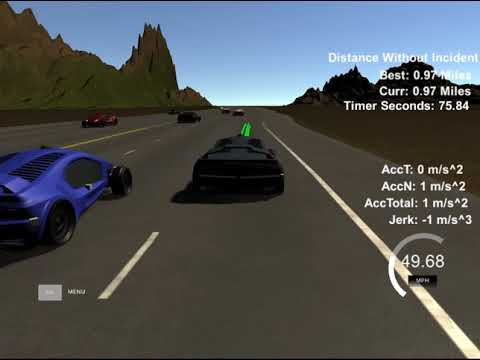

# CarND-Path Planning Project (Term 3 - Project #1)
Self-Driving Car Engineer Nanodegree Program
   
   
---
### Overview & Goals

The path planning project is creating an autonomous vehicle path plan given map waypoints and using a finite sate machine (FSM) and cost functions to create vehicle control behaviors that meet the project criteria.  The goal is to safely navigate around a virtual highway with other traffic that is driving +-10 MPH of the 50 MPH speed limit.  A "perfect controller" is used that has no delay and the output is lane and velocity values for the car controller in the Simulator.

[//]: # (Image References)

[image1]: ./images/UdacitySimulator10miles.png "Result"
[image2]: ./images/BoschCompletion.png "Result"
[image3]: ./images/PathPlanningStateTransitionMatrix4.jpg "Result"
[image4]: ./images/hqdefault.jpg "Result"

After the Path Panning module was working, I obtained the following results for both the Udacity track and the Bosch challenge track:

| Figure 1 - Udacity Track          | Figure 2 - Bosch Challenge Track  | 
| :---:                             | :---:                             |
| ![alt text][image1]               | ![alt text][image2]               |

I was able to run the self driving car for many miles without incident which included following the speed limit (50 mph), comfort rules which included maximum acceleration limit of 10 m/s^2, max jerk limit of 10 m/s^3, and lane switching time of under 3 seconds.  Below is a video of a run of my path planning framework on the Bosch Challenge track:

<!---
 
 
 

![alt text][image4](https://youtu.be/ZetEae-YMm4)]

http://img.youtube.com/vi/ZetEae-YMm4/hqdefault.jpg

A video of a run on the Bosch Challenge track can be found at [Path Planning output You Tube Video](https://youtu.be/ZetEae-YMm4) that was submitted to the Bosch Challenge.
-->
 
 
---

### Project Architecture
Key to this project was coming up with an architecture to handle the incoming telemetry data and perform the finite state machine approach to path planning.  First, I established a couple of main classes and data structures to handle the data. They are:

              1. Self Driving Car (SDC) Class "SelfDrivingCar"
              2. Tracked Vehicle Class "TrackedVehicle"

At each frame, I updated the SDC class **"av1"** with all of the data provided by my self driving car and also updated 2 arrays of tracked cars called **"cars_ahead"** and **"cars_behind"** where they were sorted by the delta_s relative to the SDC. S if the Frenet s from the SDC's x,y location and is a great way to track vehicles distance ahead and behind. The array has dimension of 3 for each lane of the highway.

Next, I analyzed ALL potential "Behaviors" (i.e. path plans) for the SDC utilizing associated path cost functions to generate an optimal path plan as defined by the minimized cost path. The next step after that is to "Predict" and/or generate the next path plan from the current path plan using the rules of the States in the Finite State Machine (FSM), and finally with a chosen lane and velocity generate the path trajectory to be sent back to the Udacity simulator. 

-ADD FLOW DIAGRAM HERE IF POSSIBLE-

---

### Finite State Machine "States"

Another important design element of this project is to define the States in the Finite State Machine (FSM) and the State behavior and transition between states. I defined 4 States for this project (the 3 recommended by Udacity and 1 more that I wanted) as follows:

| State                   | Description                                                                        | 
| :---                    |:---                                                                                |
| "KeepLane" (KL)         | (KL) Stay in current lane                                                          |
| "LaneChangeLeft" (LCL)  | When possible, the complete process of changing to the left lane from current lane |
| "LaneChangeRight" (LCR) | When possible, the complete process of changing to the right lane from current lane|
| "Emergency" (ES)        | Emergency safety maneuvers if another vehicle too close                            |

The next step is to define the transitions between each State.  This is a key step that helped immensely when coding the "Prediciton" module of the FSM.  The State transition matrix used was:

![alt text][image3]

---

### Cost Functions 

The way that the finite state machine makes decisions about the optimal State is through the calculation of a "cost" of a possible path and then choose the projected path with the least cost. This essentially maps the problem of deciding every possible path configuration to one of creating reward/cost behaviors with a series of functions and their various weights. 

I choose 5 cost functions to start and then during testing, I decided to add two more to help with various issues I encountered. The costs functions I decided to use in order of highest weighting were:

| Cost Function Name      | Description | 
| :---                    | :--- |
| 1. Collision_Risk | If there is collision risk ahead or behind, set very high cost          |
| 2. Lane_Movement | Check for a clear gap for lane movement, otherwise high cost |
| 3. Closest_Vehicle_Ahead | Higher cost the closer the vehicle is to the SDC |
| 4. Speed | Higher cost to vehicles that are going slower  |
| 5. Number_Of_Vehicles_In_Lane_Ahead | Higher cost to being in a lane with multiple vehicles |         
| 6. Preferred_Lane | Higher cost for not being in the 2nd from left lane |
| 7. Fast_Lane | In the event of a tie, assign lower lost to heading left towards the Fast Lane |

With these cost functions, I could start running scenarios in the simulator, monitor behavior and look at how the SDC behaved and consider how to tune the weights to achieve the best path control of the SDC for this project and it's requirements. 

---

### Trajectory Generation 

Once the path planner has reached the final Trajectory generation module, I now had the vehicle state of the SDC [lane, car velocity]. With this and the map Waypoints, I generated a set of path points of the SDC which is what is sent to the Simulator to actually drive the car. Two methods were presented in class, a nth order polynomial fit and a spline fitting approach. Given my background in numerical analysis, I was familar with splines and wanted to try that. 

I leveraged the code that was presented in the Udacity walkthrough video. The only improvement I made was that there was one mistake in not converting the car angle from telemetry data from degrees into radians for the transformation equations which I corrected.

The algorithm is to generate a series of anchor points representing the path of the trajectory and then smoothly up-sampling the points at the right frequency that gives the desired car velocity. 

Five target points were used including one point directly behind the car, the car itself, and then 3 points 30,60 and 90 meters in front. This approach creates a smooth transition from the previous trajectory so there arent any disjointed paths. A key algorithm technique is to transform into car Frenet space and generate the anchor points along the s (displacement) axis and then transform back to map x,y points after calculation (getXY). This avoids generating points near or at the vertical axis and introducing numerical instabilities. It has the further advantage of making defining these points straightforward.

With the spline library suggested by Udacity, it was straightforward to implement the spline fit and find the smapling points. Including one "spline.h" header file is all that was required so all the code was completely self-contained - nice!

---

## Tuning & Results 

Once the code was running, there was immediate feedback on behaviors that lead to crashes quickly. I also saw that there were behaviors that the car was not performng which made me consider adding some more cost functions (Number of Vehicles In Lane & Fast Lane). Some were straightforeward like a collision had a very high penalty where things like Preferred Lane and Fast Lane were suggestions and not high weight. The first set of weights that I established that lead to reasonably successful behavior were:

| Cost Function Name      | Weight | 
| :---                    | :--- |
| 1. Collision_Risk | 1000         |
| 2. Lane_Movement | 1000 |
| 3. Closest_Vehicle_Ahead |150 |
| 4. Speed | 20  |
| 5. Number_Of_Vehicles_In_Lane_Ahead |10|         
| 6. Preferred_Lane | 5 |
| 7. Fast_Lane |1 |

I kept the car just under 50 MPH speed, passed slower traffic when possible, noting that other cars tried to change laness too and were going faster than 50 mph! I also restricted the car to a maximum acceleration of 10 m/s^2.

As I started reducing errors, I noticed that there was a tension between the "closest vehicle ahead", "number of vehicles per lane", and "speed" cost functions that I am continuing to optimize.  There were also some instances of simulation cars aggresively cutting into my current lane - essentially cutting me off! This lead me to implement the "Emergency" State to try and respond to this type of situation which also happens in real life. This had the effect of expanding my State possibilities from 9 to 16 so I am continuing to try and implement the behaviors and transitions for all 16 states.

As shown in the introduction, I was able to complete both the Udacity track and the Bosch challenge track at good times. However, I notice that I am not completing the track 100% of the time. The Bosch challenge track is aggresive and introduces many random pertubations so I am contining to debug my solution to get a higher completion percentage.

---

## Project Dependencies, Build Instructions & Vehicle Simulator 

### Environment to Develop Project

This project was written in C++ on a Macbook Pro with the following configuration:

* macOS Sierra 10.11
* Xcode 8.2.1
* cmake >= v3.5
* make >= v4.1
* gcc/g++ >= v5.4

### Udacity Simulator

You can download the Term3 Simulator which contains the Path Planning Project from the [releases tab (https://github.com/udacity/self-driving-car-sim/releases).

### Third-Party Software

Key 3rd party software  packages used for this project are:

* uWebsockets v15
* uWebsockets dependencies (On Mac, can install via "brew install openssl zlib libuv") 
* Eigen open source math library
* spline.h - copyright (C) 2011, 2014 Tino Kluge (ttk448@gmail.com)
* JSON for Modern C++ https://nlohmann.github.io/json/json - Copyright © 2013-2017 Niels Lohmann

This project involves the Term 2 Simulator which can be downloaded [here](https://github.com/udacity/self-driving-car-sim/releases).  This repository includes two files that can be used to set up and intall [uWebSocketIO](https://github.com/uWebSockets/uWebSockets) for either Linux or Mac systems. For windows you can use either Docker, VMware, or even [Windows 10 Bash on Ubuntu](https://www.howtogeek.com/249966/how-to-install-and-use-the-linux-bash-shell-on-windows-10/) to install uWebSocketIO. 

Once the install for uWebSocketIO and other configuration is complete, the main program can be built and run by doing the following from the project top directory.

1. mkdir build
2. cd build
3. cmake ..
4. make
5. ./path-planning

The files that are needed to compile this project found in cmakelist.txt are:

* src/main.cpp
* src/selfdrivingcar.cpp
* src/trackedcar.cpp
* src/costfunctions.cpp
* src/pathplanningutils.cpp
* src/map.cpp 

---

## Further Developments

I see that more creative things can be done with the cost functions to further optimize performance. I would like to experiment further with better weights that balance the priorities that are in conflict with each other including velocity, distance, and vehicle gaps.

Also, there are several transitions that could be enhanced to handle back-ups and recovery from being cut off that would be interesting to implement.

Finally, after completing this project, I think it would be better to re-architect the data to store velocity averages for both the SDC and tracked cars. Further, since each tracked car has a unique ID, it is probably advantageous to keep a running record of each tracked car by ID which would allow more sophisticated analysis of the environment the SDC is in.

Thanks!  Steve
